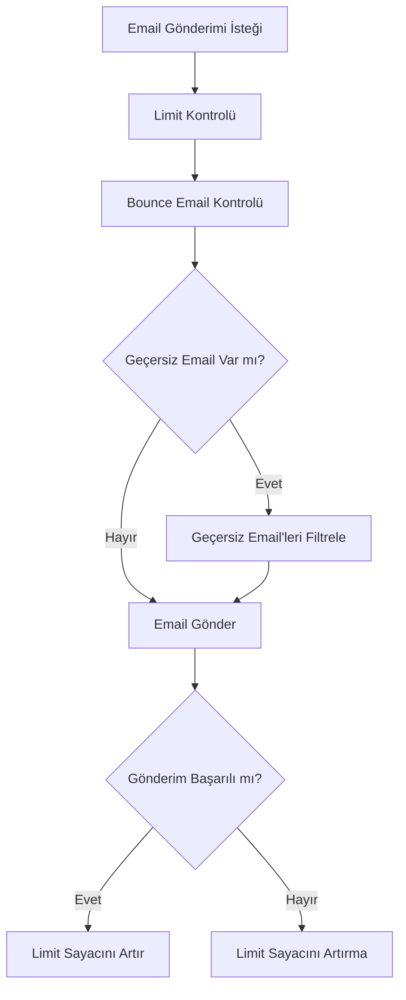
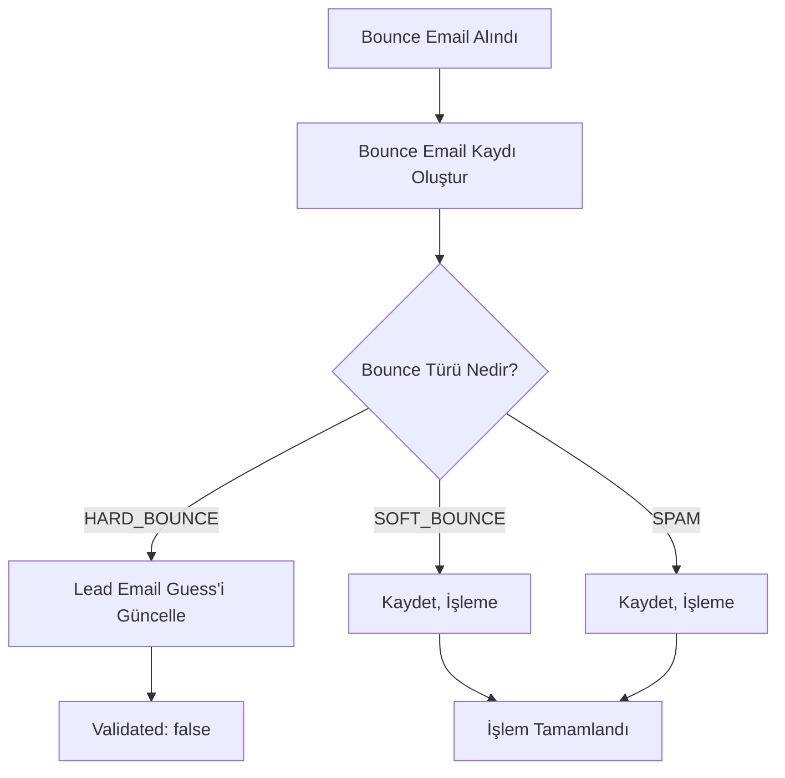

# Bounce Email Sistemi - Detaylı Rehber

## Genel Bakış

Bounce Email Sistemi, geçersiz email adreslerini takip eden, bounce email'leri işleyen ve lead email guess tablosunu güncelleyen kapsamlı bir sistemdir. Bu sistem, geçersiz email'leri tespit eder, lead email guess tablosunda `validated` alanını `false` yapar ve sadece başarılı email gönderimlerini günlük limit sayacından düşürür.

## Özellikler

### 🔧 Temel Özellikler
- **Bounce Email Takibi**: Geçersiz email'leri tespit etme ve kaydetme
- **Lead Email Guess Güncelleme**: Geçersiz email'leri `validated: false` yapma
- **Akıllı Limit Yönetimi**: Sadece başarılı gönderimleri sayma
- **Bounce Filtreleme**: Geçersiz email'leri gönderim listesinden çıkarma
- **İstatistik ve Raporlama**: Bounce email istatistikleri

### 📊 Bounce Türleri
- **HARD_BOUNCE**: Kalıcı geçersiz email (kullanıcı mevcut değil)
- **SOFT_BOUNCE**: Geçici geçersiz email (mailbox dolu, geçici hata)
- **BLOCKED**: Engellenmiş email
- **SPAM**: Spam olarak işaretlenmiş email

## Veritabanı Yapısı

### BounceEmail Entity

```sql
CREATE TABLE bounce_emails (
    id BIGSERIAL PRIMARY KEY,
    user_id BIGINT REFERENCES users(id),
    lead_id BIGINT REFERENCES leads(id),
    email_address VARCHAR(255) NOT NULL,
    bounce_type VARCHAR(50) NOT NULL, -- HARD_BOUNCE, SOFT_BOUNCE, BLOCKED, SPAM
    bounce_reason TEXT,
    original_message_id VARCHAR(255),
    provider VARCHAR(20), -- GMAIL, OUTLOOK, SMTP
    processed BOOLEAN DEFAULT false,
    bounce_date TIMESTAMP,
    created_at TIMESTAMP,
    updated_at TIMESTAMP
);

-- İndeksler
CREATE INDEX idx_bounce_emails_email_address ON bounce_emails(email_address);
CREATE INDEX idx_bounce_emails_bounce_type ON bounce_emails(bounce_type);
CREATE INDEX idx_bounce_emails_processed ON bounce_emails(processed);
CREATE INDEX idx_bounce_emails_bounce_date ON bounce_emails(bounce_date);
```

## Sistem Akışı

### 1. Email Gönderimi Öncesi Kontrol



### 2. Bounce Email İşleme



## API Endpoints

### 🔧 Admin Endpoint'leri

#### 1. Bounce Email İşleme
```http
POST /v1/bounce-emails/process?emailAddress={email}&bounceType={type}&bounceReason={reason}&originalMessageId={id}&provider={provider}&userId={userId}
```

**Response:**
```json
{
    "success": true,
    "message": "Bounce email processed successfully",
    "data": "Bounce email processed successfully"
}
```

#### 2. Bounce İstatistikleri
```http
GET /v1/bounce-emails/statistics?emailAddress={email}
```

**Response:**
```json
{
    "success": true,
    "message": "Bounce statistics retrieved successfully",
    "data": {
        "emailAddress": "test@example.com",
        "totalBounces": 3,
        "hardBounces": 1,
        "softBounces": 2,
        "spamReports": 0,
        "hasRecentHardBounces": true
    }
}
```

#### 3. Tüm İşlenmemiş Bounce'ları İşleme
```http
POST /v1/bounce-emails/process-all
```

**Response:**
```json
{
    "success": true,
    "message": "All unprocessed bounces processed successfully",
    "data": "All unprocessed bounces processed successfully"
}
```

### 🔧 Kullanıcı Endpoint'leri

#### 4. Email Bounce Kontrolü
```http
GET /v1/bounce-emails/check?emailAddress={email}
```

**Response:**
```json
{
    "success": true,
    "message": "Email bounce check completed successfully",
    "data": {
        "emailAddress": "test@example.com",
        "hasRecentHardBounces": true,
        "isValidForSending": false
    }
}
```

## Kullanım Senaryoları

### 1. Bounce Email İşleme

```javascript
// Admin tarafından bounce email işleme
async function processBounceEmail(emailAddress, bounceType, bounceReason) {
    try {
        const response = await fetch('/v1/bounce-emails/process', {
            method: 'POST',
            headers: { 'Content-Type': 'application/json' },
            body: JSON.stringify({
                emailAddress: emailAddress,
                bounceType: bounceType, // HARD_BOUNCE, SOFT_BOUNCE, BLOCKED, SPAM
                bounceReason: bounceReason,
                originalMessageId: 'message123',
                provider: 'GMAIL',
                userId: 1001
            })
        });
        
        if (response.ok) {
            console.log('Bounce email processed successfully');
        }
        
    } catch (error) {
        console.error('Failed to process bounce email:', error);
    }
}
```

### 2. Email Gönderimi Öncesi Bounce Kontrolü

```javascript
// Email gönderimi öncesi bounce kontrolü
async function sendEmailWithBounceCheck(userId, emailData) {
    try {
        // Bounce kontrolü otomatik olarak EmailService içinde yapılır
        const response = await fetch('/v1/emails/send', {
            method: 'POST',
            headers: { 'Content-Type': 'application/json' },
            body: JSON.stringify({
                userId: userId,
                toEmails: ['valid@example.com', 'bounced@example.com'],
                subject: 'Test Email',
                body: 'Test content'
            })
        });
        
        if (response.ok) {
            // Sadece geçerli email'lere gönderildi
            console.log('Email sent successfully');
        }
        
    } catch (error) {
        console.error('Email sending failed:', error);
    }
}
```

### 3. Bounce İstatistikleri Görüntüleme

```javascript
// Email bounce istatistiklerini görüntüleme
async function getBounceStatistics(emailAddress) {
    try {
        const response = await fetch(`/v1/bounce-emails/statistics?emailAddress=${emailAddress}`);
        const result = await response.json();
        
        if (result.success) {
            const stats = result.data;
            console.log(`Total bounces: ${stats.totalBounces}`);
            console.log(`Hard bounces: ${stats.hardBounces}`);
            console.log(`Has recent hard bounces: ${stats.hasRecentHardBounces}`);
        }
        
    } catch (error) {
        console.error('Failed to get bounce statistics:', error);
    }
}
```

## Limit Yönetimi

### Akıllı Limit Sistemi

Sistem artık sadece başarılı email gönderimlerini limit sayacından düşürür:

1. **Gönderim Öncesi**: Limit kontrolü yapılır (sayacı artırmaz)
2. **Bounce Kontrolü**: Geçersiz email'ler filtrelenir
3. **Gönderim**: Email gönderilir
4. **Başarılı Gönderim**: Limit sayacı artırılır

### Limit Akışı

```java
// EmailService.sendEmail() metodunda:
public void sendEmail(Long userId, EmailSendRequestDto request) {
    // 1. Limit kontrolü (sayacı artırmaz)
    dailyEmailLimitService.validateEmailLimit(userId);
    
    // 2. Bounce kontrolü
    checkAndFilterBounceEmails(request);
    
    // 3. Email gönderimi
    sendEmailViaProvider(userId, request);
    
    // 4. Başarılı gönderim sonrası sayacı artır
    dailyEmailLimitService.incrementSuccessfulEmailCount(userId);
}
```

## Bounce Email Türleri ve İşleme

### HARD_BOUNCE
- **Açıklama**: Kalıcı geçersiz email adresi
- **İşlem**: Lead email guess'te `validated: false` yapılır
- **Örnek**: "User unknown", "Mailbox not found"

### SOFT_BOUNCE
- **Açıklama**: Geçici geçersiz email adresi
- **İşlem**: Kaydedilir, ancak lead email guess güncellenmez
- **Örnek**: "Mailbox full", "Temporary failure"

### BLOCKED
- **Açıklama**: Engellenmiş email adresi
- **İşlem**: Kaydedilir, gelecekte gönderim engellenir
- **Örnek**: "Blocked by recipient", "Domain policy"

### SPAM
- **Açıklama**: Spam olarak işaretlenmiş
- **İşlem**: Kaydedilir, spam skoru artırılır
- **Örnek**: "Marked as spam", "Spam filter"

## Otomatik İşlemler

### 🕐 Zamanlanmış Görevler

#### 1. Bounce Email İşleme (30 dakikada bir)
```java
@Scheduled(cron = "0 */30 * * * ?")
public void processUnprocessedBounces()
```
- İşlenmemiş bounce email'leri işler
- Lead email guess'leri günceller

#### 2. Bounce İstatistikleri (Günlük)
```java
@Scheduled(cron = "0 0 0 * * ?")
public void logBounceEmailStatistics()
```
- Günlük bounce email istatistiklerini loglar

## Güvenlik ve Performans

### 🔐 Güvenlik Önlemleri
- **Admin Yetkilendirme**: Bounce işleme sadece admin tarafından
- **Kullanıcı Doğrulama**: Her kullanıcı sadece kendi bounce'larını görebilir
- **Veri Bütünlüğü**: Bounce kayıtları güvenli şekilde saklanır

### ⚡ Performans Optimizasyonu
- **Veritabanı İndeksleri**: Hızlı bounce sorguları
- **Filtreleme**: Gönderim öncesi geçersiz email'leri filtreleme
- **Batch İşlemler**: Toplu bounce işleme

## Hata Kodları

| Kod | Açıklama |
|-----|----------|
| ERR_7019 | Failed to process bounce email |
| ERR_7020 | Failed to get bounce statistics |
| ERR_7021 | Failed to process all unprocessed bounces |
| ERR_7022 | Failed to check email bounces |

## Sorun Giderme

### Yaygın Sorunlar

#### 1. Bounce Email İşlenmiyor
- **Sebep**: BounceEmailService inject edilmemiş
- **Çözüm**: EmailService constructor'ına BounceEmailService ekleyin

#### 2. Lead Email Guess Güncellenmiyor
- **Sebep**: LeadEmailGuessRepository'de metod eksik
- **Çözüm**: `findByGuessedEmail` metodunu ekleyin

#### 3. Limit Sayacı Yanlış
- **Sebep**: Başarısız gönderimler de sayılıyor
- **Çözüm**: Sadece başarılı gönderimlerde `incrementSuccessfulEmailCount` çağırın

### Debug İpuçları
1. **Log Kontrolü**: SystemLog tablosunu kontrol edin
2. **Bounce Kayıtları**: BounceEmail tablosunu kontrol edin
3. **Lead Email Guess**: LeadEmailGuess tablosunu kontrol edin
4. **Limit Kayıtları**: DailyEmailLimit tablosunu kontrol edin

## Gelecek Geliştirmeler

### 🚀 Planlanan Özellikler
- **Otomatik Bounce Tespiti**: Email sağlayıcılarından otomatik bounce alma
- **Bounce Skorlama**: Email adreslerine bounce skoru verme
- **Akıllı Filtreleme**: Makine öğrenmesi ile bounce tahmini
- **Bounce Raporlama**: Detaylı bounce raporları
- **Webhook Entegrasyonu**: Gerçek zamanlı bounce bildirimleri

### 🔧 Teknik İyileştirmeler
- **Redis Cache**: Bounce bilgilerini cache'leme
- **Queue System**: Asenkron bounce işleme
- **Monitoring**: Prometheus metrikleri
- **Alerting**: Yüksek bounce oranı uyarıları
- **Backup**: Otomatik bounce verisi yedekleme

## Test Senaryoları

### 1. Bounce Email İşleme Testi
```javascript
// Test: Hard bounce sonrası lead email guess güncellenmeli
async function testHardBounceProcessing() {
    // Bounce email işle
    await processBounceEmail('test@example.com', 'HARD_BOUNCE', 'User unknown');
    
    // Lead email guess kontrol et
    const guess = await getLeadEmailGuess('test@example.com');
    assert(guess.validated === false);
}
```

### 2. Limit Yönetimi Testi
```javascript
// Test: Başarısız gönderim limit sayacını artırmamalı
async function testFailedEmailLimit() {
    const initialLimit = await getEmailLimit(userId);
    
    // Başarısız email gönderimi simüle et
    try {
        await sendEmail(userId, invalidEmailData);
    } catch (error) {
        // Hata alınmalı
    }
    
    const finalLimit = await getEmailLimit(userId);
    assert(finalLimit.sentCount === initialLimit.sentCount);
}
```

## Destek

### 📞 Teknik Destek
- **Email**: support@prospectcrm.com
- **Dokümantasyon**: https://docs.prospectcrm.com
- **GitHub**: https://github.com/prospectcrm

### 📚 Ek Kaynaklar
- [Email Management Guide](./EMAIL_MANAGEMENT.md)
- [Daily Email Limit System](./DAILY_EMAIL_LIMIT_SYSTEM.md)
- [Email Draft Management Guide](./EMAIL_DRAFT_MANAGEMENT.md)
- [API Reference Documentation](./API_REFERENCE.md) 