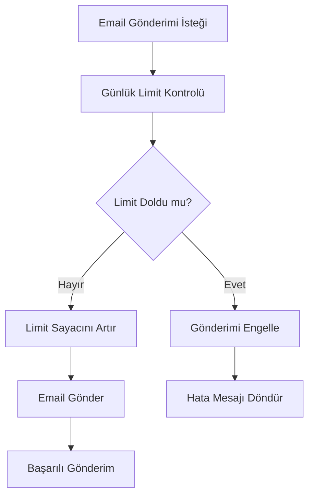
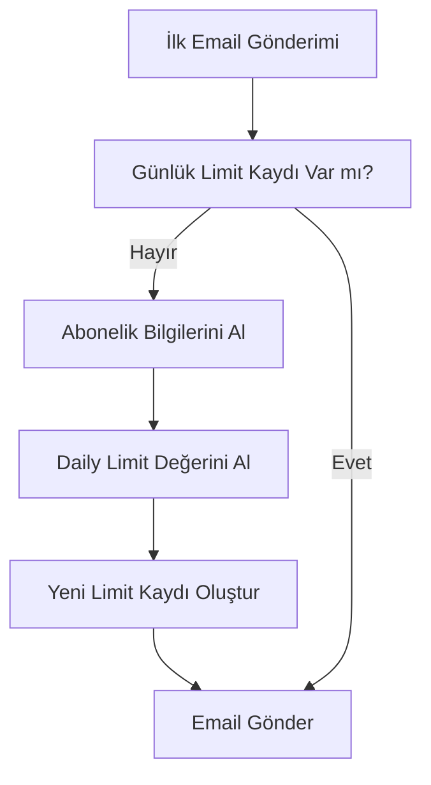

# Günlük Email Gönderim Limiti Sistemi - Detaylı Rehber

## Genel Bakış

Günlük Email Gönderim Limiti Sistemi, kullanıcıların abonelik tipine göre günlük email gönderim sayısını kontrol eden ve limit dolduğunda gönderimi engelleyen kapsamlı bir sistemdir. Bu sistem, abonelik planlarına göre farklı günlük limitler tanımlamanıza ve kullanıcıların bu limitleri aşmasını engellemenize olanak sağlar.

## Özellikler

### 🔧 Temel Özellikler
- **Abonelik Bazlı Limit**: Her abonelik tipine göre farklı günlük limitler
- **Günlük Takip**: Her gün için ayrı limit takibi
- **Otomatik Kontrol**: Email gönderimi öncesi otomatik limit kontrolü
- **Gerçek Zamanlı Bilgi**: Kalan email sayısı ve limit durumu
- **Admin Yönetimi**: Admin tarafından limit sıfırlama ve yönetimi

### 📊 İzleme ve Raporlama
- **Günlük İstatistikler**: Her gün için detaylı istatistikler
- **Otomatik Temizlik**: 30 günden eski kayıtların otomatik temizlenmesi
- **Log Sistemi**: Tüm limit işlemlerinin detaylı loglanması
- **Performans Optimizasyonu**: Veritabanı indeksleri ve sorgu optimizasyonu

## Veritabanı Yapısı

### DailyEmailLimit Entity

```sql
CREATE TABLE daily_email_limits (
    id BIGSERIAL PRIMARY KEY,
    user_id BIGINT REFERENCES users(id),
    date DATE NOT NULL,
    sent_count INTEGER DEFAULT 0,
    daily_limit INTEGER NOT NULL,
    created_at TIMESTAMP,
    updated_at TIMESTAMP,
    UNIQUE(user_id, date)
);

-- İndeksler
CREATE INDEX idx_daily_email_limits_user_date ON daily_email_limits(user_id, date);
CREATE INDEX idx_daily_email_limits_date ON daily_email_limits(date);
```

### SubscriptionType Entity (Güncellenmiş)

```sql
ALTER TABLE subscription_type ADD COLUMN daily_limit INTEGER DEFAULT 10;
```

## Sistem Akışı

### 1. Email Gönderimi Öncesi Kontrol



### 2. Limit Oluşturma Süreci



## API Endpoints

### 🔧 Kullanıcı Endpoint'leri

#### 1. Günlük Limit Durumu
```http
GET /v1/email-limits/status?userId={userId}
```

**Response:**
```json
{
    "success": true,
    "message": "Email limit status retrieved successfully",
    "data": {
        "dailyLimit": 100,
        "sentCount": 25,
        "remainingEmails": 75,
        "canSend": true,
        "date": "2024-01-15"
    }
}
```

#### 2. Kalan Email Sayısı
```http
GET /v1/email-limits/remaining?userId={userId}
```

**Response:**
```json
{
    "success": true,
    "message": "Remaining emails retrieved successfully",
    "data": {
        "remainingEmails": 75,
        "canSend": true
    }
}
```

### 🔧 Admin Endpoint'leri

#### 3. Limit Sıfırlama
```http
POST /v1/email-limits/reset?userId={userId}
```

**Response:**
```json
{
    "success": true,
    "message": "Daily email limit reset successfully",
    "data": "Daily limit reset successfully"
}
```

#### 4. Detaylı Limit Durumu (Admin)
```http
GET /v1/email-limits/admin/status?userId={userId}
```

**Response:**
```json
{
    "success": true,
    "message": "Email limit status retrieved successfully",
    "data": {
        "userId": 1001,
        "dailyLimit": 100,
        "sentCount": 25,
        "remainingEmails": 75,
        "canSend": true,
        "date": "2024-01-15",
        "createdAt": "2024-01-15T00:00:00",
        "updatedAt": "2024-01-15T14:30:00"
    }
}
```

## Kullanım Senaryoları

### 1. Email Gönderimi Öncesi Kontrol

```javascript
// Email gönderimi öncesi limit kontrolü
async function sendEmailWithLimitCheck(userId, emailData) {
    try {
        // Limit kontrolü otomatik olarak EmailService içinde yapılır
        const response = await fetch('/v1/emails/send', {
            method: 'POST',
            headers: { 'Content-Type': 'application/json' },
            body: JSON.stringify({
                userId: userId,
                ...emailData
            })
        });
        
        if (!response.ok) {
            const error = await response.json();
            if (error.message.includes('Daily email limit reached')) {
                // Limit dolmuş, kullanıcıya bilgi ver
                showLimitExceededMessage();
                return;
            }
        }
        
        // Email başarıyla gönderildi
        showSuccessMessage();
        
    } catch (error) {
        console.error('Email sending failed:', error);
    }
}
```

### 2. Limit Durumu Kontrolü

```javascript
// Kullanıcı arayüzünde limit durumunu göster
async function displayEmailLimitStatus(userId) {
    try {
        const response = await fetch(`/v1/email-limits/status?userId=${userId}`);
        const result = await response.json();
        
        if (result.success) {
            const status = result.data;
            
            // Progress bar göster
            const progress = (status.sentCount / status.dailyLimit) * 100;
            updateProgressBar(progress);
            
            // Kalan email sayısını göster
            updateRemainingEmails(status.remainingEmails);
            
            // Limit dolmuşsa uyarı göster
            if (!status.canSend) {
                showLimitWarning();
            }
        }
        
    } catch (error) {
        console.error('Failed to get limit status:', error);
    }
}
```

### 3. Admin Limit Yönetimi

```javascript
// Admin panelinde limit sıfırlama
async function resetUserDailyLimit(userId) {
    try {
        const response = await fetch('/v1/email-limits/reset', {
            method: 'POST',
            headers: { 'Content-Type': 'application/json' },
            body: JSON.stringify({ userId: userId })
        });
        
        if (response.ok) {
            showSuccessMessage('Daily limit reset successfully');
            refreshUserList();
        } else {
            showErrorMessage('Failed to reset limit');
        }
        
    } catch (error) {
        console.error('Reset failed:', error);
    }
}
```

## Abonelik Planları ve Limitler

### Varsayılan Limitler

| Abonelik Tipi | Günlük Limit | Açıklama |
|---------------|--------------|----------|
| Trial Plan | 10 | 3 günlük deneme planı |
| Basic Plan | 100 | Aylık temel plan |
| Premium Plan | 500 | Aylık premium plan |
| Enterprise Plan | 1000 | Aylık kurumsal plan |

### Limit Yapılandırması

```sql
-- Abonelik tiplerini güncelle
UPDATE subscription_type SET daily_limit = 10 WHERE code = 'trial';
UPDATE subscription_type SET daily_limit = 100 WHERE code = 'basic';
UPDATE subscription_type SET daily_limit = 500 WHERE code = 'premium';
UPDATE subscription_type SET daily_limit = 1000 WHERE code = 'enterprise';
```

## Güvenlik ve Performans

### 🔐 Güvenlik Önlemleri
- **Kullanıcı Doğrulama**: Her kullanıcı sadece kendi limitini görebilir
- **Admin Yetkilendirme**: Limit sıfırlama sadece admin tarafından yapılabilir
- **Veri Bütünlüğü**: Unique constraint ile duplicate kayıtlar engellenir
- **SQL Injection Koruması**: Prepared statement kullanımı

### ⚡ Performans Optimizasyonu
- **Veritabanı İndeksleri**: Hızlı sorgu performansı
- **Caching**: Sık kullanılan limit bilgileri cache'lenir
- **Batch İşlemler**: Toplu limit güncellemeleri
- **Otomatik Temizlik**: Eski kayıtların otomatik silinmesi

## Hata Kodları

| Kod | Açıklama |
|-----|----------|
| ERR_7014 | Failed to get email limit status |
| ERR_7015 | Failed to get remaining emails |
| ERR_7016 | Failed to reset daily limit |
| ERR_7017 | Daily email limit reached |
| ERR_7018 | Failed to create email limit record |

## Otomatik İşlemler

### 🕐 Zamanlanmış Görevler

#### 1. Günlük Temizlik (00:00)
```java
@Scheduled(cron = "0 0 0 * * ?")
public void cleanupOldDailyEmailLimits()
```
- 30 günden eski limit kayıtlarını siler
- Veritabanı performansını korur

#### 2. Günlük İstatistikler (06:00)
```java
@Scheduled(cron = "0 0 6 * * ?")
public void logDailyEmailLimitStatistics()
```
- Dünün email gönderim istatistiklerini loglar
- Sistem performansını izler

## Sorun Giderme

### Yaygın Sorunlar

#### 1. Limit Kontrolü Çalışmıyor
- **Sebep**: DailyEmailLimitService inject edilmemiş
- **Çözüm**: EmailService constructor'ına DailyEmailLimitService ekleyin

#### 2. Limit Kaydı Oluşturulmuyor
- **Sebep**: Kullanıcının aktif aboneliği yok
- **Çözüm**: Kullanıcıya aktif abonelik atayın

#### 3. Limit Sıfırlanmıyor
- **Sebep**: Admin yetkisi yok
- **Çözüm**: Kullanıcıya ADMIN rolü verin

### Debug İpuçları
1. **Log Kontrolü**: SystemLog tablosunu kontrol edin
2. **Veritabanı**: DailyEmailLimit tablosunu kontrol edin
3. **Abonelik**: UserSubsInfo tablosunu kontrol edin
4. **Scheduler**: Zamanlanmış görevlerin çalışıp çalışmadığını kontrol edin

## Gelecek Geliştirmeler

### 🚀 Planlanan Özellikler
- **Dinamik Limitler**: Kullanıcı bazında özel limitler
- **Limit Artırma**: Kullanıcıların limit artırma talepleri
- **Bildirimler**: Limit dolmaya yaklaştığında uyarılar
- **Analitik Dashboard**: Detaylı limit kullanım analizi
- **API Rate Limiting**: API çağrı limitleri
- **Webhook Entegrasyonu**: Limit durumu değişikliklerinde webhook

### 🔧 Teknik İyileştirmeler
- **Redis Cache**: Limit bilgilerini cache'leme
- **Queue System**: Asenkron limit güncellemeleri
- **Monitoring**: Prometheus metrikleri
- **Alerting**: Limit aşımı uyarıları
- **Backup**: Otomatik limit verisi yedekleme

## Test Senaryoları

### 1. Limit Kontrolü Testi
```javascript
// Test: Limit dolduğunda email gönderimi engellenmeli
async function testLimitExceeded() {
    // Kullanıcının limitini doldur
    await fillUserLimit(userId);
    
    // Email göndermeyi dene
    const response = await sendEmail(userId, emailData);
    
    // Hata almalı
    assert(response.status === 400);
    assert(response.message.includes('Daily email limit reached'));
}
```

### 2. Limit Sıfırlama Testi
```javascript
// Test: Admin limit sıfırlayabilmeli
async function testLimitReset() {
    // Admin olarak limit sıfırla
    const response = await resetLimit(userId);
    
    // Başarılı olmalı
    assert(response.status === 200);
    
    // Limit sıfırlanmış olmalı
    const status = await getLimitStatus(userId);
    assert(status.sentCount === 0);
}
```

## Destek

### 📞 Teknik Destek
- **Email**: support@prospectcrm.com
- **Dokümantasyon**: https://docs.prospectcrm.com
- **GitHub**: https://github.com/prospectcrm

### 📚 Ek Kaynaklar
- [Email Management Guide](./EMAIL_MANAGEMENT.md)
- [Email Draft Management Guide](./EMAIL_DRAFT_MANAGEMENT.md)
- [Subscription Management Guide](./SUBSCRIPTION_MANAGEMENT.md)
- [API Reference Documentation](./API_REFERENCE.md) 