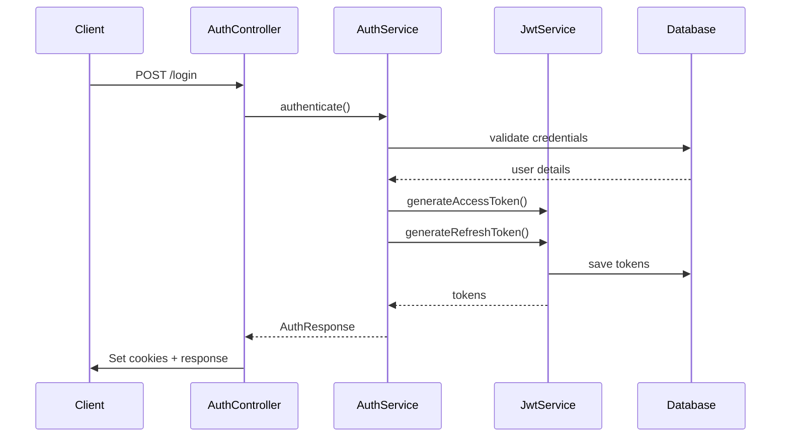
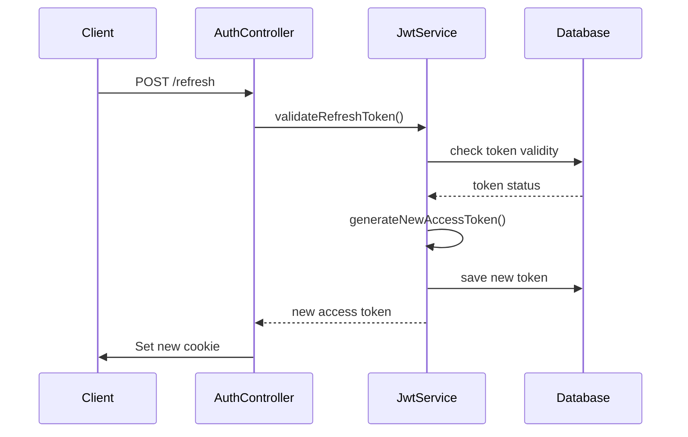
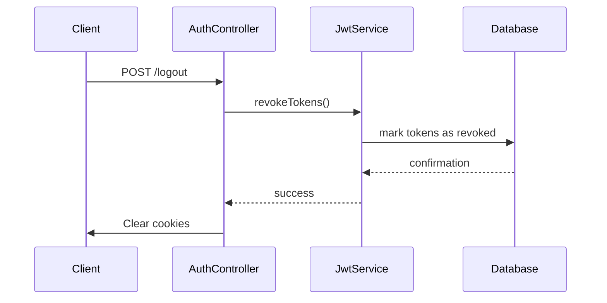

# JWT (JSON Web Token) Detaylı Rehberi

## 📋 İçindekiler

1. [JWT Nedir?](#jwt-nedir)
2. [JWT Yapısı](#jwt-yapısı)
3. [Prospect CRM JWT Implementasyonu](#prospect-crm-jwt-implementasyonu)
4. [Güvenlik Özellikleri](#güvenlik-özellikleri)
5. [Token Yaşam Döngüsü](#token-yaşam-döngüsü)
6. [API Endpoint'leri](#api-endpointleri)
7. [Hata Yönetimi](#hata-yönetimi)
8. [Monitoring ve Logging](#monitoring-ve-logging)
9. [Production Deployment](#production-deployment)
10. [Troubleshooting](#troubleshooting)
11. [Best Practices](#best-practices)
12. [Security Checklist](#security-checklist)

---

## 🔐 JWT Nedir?

### Tanım
JWT (JSON Web Token), taraflar arasında güvenli bilgi aktarımı için kullanılan açık bir standarttır. RFC 7519 standardına uygun olarak tanımlanmıştır.

### Avantajları
- **Stateless:** Sunucu tarafında session saklama gerektirmez
- **Scalable:** Mikroservis mimarisine uygun
- **Self-contained:** Tüm gerekli bilgi token içinde
- **Cross-domain:** Farklı domain'ler arası kullanım
- **Standard:** RFC 7519 standardına uygun

### Dezavantajları
- **Size:** Her istekte token gönderilir
- **Revocation:** Token iptal etme zorluğu
- **Storage:** Client-side'da güvenli saklama
- **Security:** XSS ve CSRF saldırılarına açık

---

## 🏗️ JWT Yapısı

### Token Formatı
```
header.payload.signature
```

### 1. Header (Başlık)
```json
{
  "alg": "HS256",
  "typ": "JWT"
}
```

**Alanlar:**
- `alg`: Kullanılan algoritma (HS256, RS256, ES256)
- `typ`: Token tipi (JWT)
- `kid`: Key ID (opsiyonel)
- `x5u`: X.509 URL (opsiyonel)

### 2. Payload (Yük)
```json
{
  "sub": "user@example.com",
  "userId": 1001,
  "username": "admin",
  "tokenType": "ACCESS",
  "iss": "prospect-crm",
  "aud": "prospect-crm-users",
  "iat": 1640995200,
  "exp": 1641002400,
  "jti": "unique-token-id"
}
```

**Standard Claims:**
- `sub` (Subject): Token sahibi
- `iss` (Issuer): Token yayınlayıcı
- `aud` (Audience): Hedef kitle
- `iat` (Issued At): Yayınlanma zamanı
- `exp` (Expiration): Son kullanma zamanı
- `nbf` (Not Before): Geçerli olma başlangıcı
- `jti` (JWT ID): Benzersiz token ID

**Custom Claims:**
- `userId`: Kullanıcı ID'si
- `username`: Kullanıcı adı
- `tokenType`: Token tipi (ACCESS/REFRESH)
- `roles`: Kullanıcı rolleri
- `permissions`: İzinler

### 3. Signature (İmza)
```
HMACSHA256(
  base64UrlEncode(header) + "." +
  base64UrlEncode(payload),
  secret
)
```

---

## 🚀 Prospect CRM JWT Implementasyonu

### Konfigürasyon

#### application.properties
```properties
# JWT Configuration
jwt.secret=eyJhbGciOiJIUzI1NiJ9X2N1c3RvbV9zZWNyZXRfa2V5X2Zvcl9wcm9zcGVjdF9jcm1fc3lzdGVtX3ZlcnlfbG9uZ19hbmRfc2VjdXJlX2Zvcl9wcm9kdWN0aW9uX3VzZV9tYWtlX2l0X3ZlcnlfbG9uZ19hbmRfc2VjdXJl
jwt.issuer=prospect-crm
jwt.audience=prospect-crm-users
jwt.access-token-expiration=7200
jwt.refresh-token-expiration=28800
jwt.access-token-cookie-name=access_token
jwt.refresh-token-cookie-name=refresh_token
jwt.cookie-domain=localhost
jwt.cookie-path=/
jwt.cookie-secure=false
jwt.cookie-http-only=true
jwt.cookie-max-age=28800
```

#### JwtConfig.java
```java
@Data
@Component
@ConfigurationProperties(prefix = "jwt")
public class JwtConfig {
    private String secret;
    private String issuer;
    private String audience;
    private long accessTokenExpiration;
    private long refreshTokenExpiration;
    private String accessTokenCookieName;
    private String refreshTokenCookieName;
    private String cookieDomain;
    private String cookiePath;
    private boolean cookieSecure;
    private boolean cookieHttpOnly;
    private int cookieMaxAge;
}
```

### Token Tipleri

#### 1. Access Token
- **Süre:** 2 saat (7200 saniye)
- **Kullanım:** API istekleri
- **Güvenlik:** Kısa süreli, sık yenilenir
- **Claims:** userId, email, username, roles

#### 2. Refresh Token
- **Süre:** 8 saat (28800 saniye)
- **Kullanım:** Access token yenileme
- **Güvenlik:** Uzun süreli, güvenli saklanır
- **Claims:** userId, tokenType

### Token Oluşturma

#### JwtService.generateToken()
```java
private String generateToken(Users user, TokenType tokenType, long expirationSeconds) {
    try {
        // 1. Secret key oluştur
        SecretKey key = Keys.hmacShaKeyFor(jwtConfig.getSecret().getBytes(StandardCharsets.UTF_8));
        
        // 2. Zaman hesaplamaları
        Date now = new Date();
        Date expiryDate = new Date(now.getTime() + (expirationSeconds * 1000));
        
        // 3. Claims hazırla
        Map<String, Object> claims = new HashMap<>();
        claims.put("userId", user.getId());
        claims.put("email", user.getEmail());
        claims.put("username", user.getUsername());
        claims.put("tokenType", tokenType.name());
        
        // 4. Token oluştur
        String token = Jwts.builder()
                .setClaims(claims)
                .setSubject(user.getEmail())
                .setIssuer(jwtConfig.getIssuer())
                .setAudience(jwtConfig.getAudience())
                .setIssuedAt(now)
                .setExpiration(expiryDate)
                .signWith(key, SignatureAlgorithm.HS256)
                .compact();
        
        // 5. Veritabanına kaydet
        saveToken(user, token, tokenType, expiryDate);
        
        // 6. Log
        systemLogService.logSecurity("JWT token generated", 
            "Token type: " + tokenType + ", User: " + user.getEmail(),
            user.getId().toString(), null, null);
        
        return token;
        
    } catch (Exception e) {
        log.error("Error generating JWT token: {}", e.getMessage(), e);
        throw new RuntimeException("Failed to generate JWT token", e);
    }
}
```

### Token Doğrulama

#### JwtService.validateToken()
```java
public Claims validateToken(String token) {
    try {
        // 1. Secret key oluştur
        SecretKey key = Keys.hmacShaKeyFor(jwtConfig.getSecret().getBytes(StandardCharsets.UTF_8));
        
        // 2. Token parse et
        Claims claims = Jwts.parserBuilder()
                .setSigningKey(key)
                .build()
                .parseClaimsJws(token)
                .getBody();
        
        // 3. Veritabanı kontrolü
        if (!isTokenActive(token)) {
            throw new JwtException("Token is revoked or expired in database");
        }
        
        return claims;
        
    } catch (ExpiredJwtException e) {
        log.warn("JWT token expired: {}", e.getMessage());
        throw new JwtException("Token expired");
    } catch (JwtException e) {
        log.error("JWT token validation failed: {}", e.getMessage());
        throw e;
    }
}
```

---

## 🔒 Güvenlik Özellikleri

### 1. Token İmzalama
- **Algoritma:** HS256 (HMAC SHA-256)
- **Secret:** 168 karakter uzunluğunda güvenli string
- **Entropy:** Yüksek entropi ile rastgele üretim

### 2. Token Doğrulama
- **İmza Kontrolü:** Her token'da imza doğrulanır
- **Süre Kontrolü:** Expiration date kontrol edilir
- **Veritabanı Kontrolü:** Token'ın revoke edilip edilmediği kontrol edilir
- **Issuer Kontrolü:** Token yayınlayıcı kontrol edilir
- **Audience Kontrolü:** Hedef kitle kontrol edilir

### 3. Cookie Güvenliği
- **HttpOnly:** JavaScript erişimi engellenir
- **Secure:** HTTPS üzerinden gönderilir (production)
- **SameSite:** CSRF koruması
- **Domain:** Sadece belirtilen domain'den erişim
- **Path:** Sadece belirtilen path'den erişim

### 4. Token Blacklisting
- **Veritabanı Tracking:** Tüm token'lar veritabanında saklanır
- **Revocation:** Token'lar iptal edilebilir
- **Expiration Tracking:** Süresi dolan token'lar işaretlenir

---

## 🔄 Token Yaşam Döngüsü

### 1. Login Süreci


### 2. Token Yenileme


### 3. Logout Süreci


---

## 🌐 API Endpoint'leri

### Authentication Endpoints

#### 1. Login
```http
POST /v1/auth/login
Content-Type: application/json

{
  "username": "admin",
  "password": "admin"
}
```

**Response:**
```json
{
  "success": true,
  "data": {
    "accessToken": "eyJhbGciOiJIUzI1NiJ9...",
    "refreshToken": "eyJhbGciOiJIUzI1NiJ9...",
    "user": {
      "id": 1001,
      "username": "admin",
      "email": "admin@prospect.com",
      "roles": ["ADMIN"]
    }
  },
  "message": "Login successful"
}
```

#### 2. Refresh Token
```http
POST /v1/auth/refresh
Cookie: refresh_token=eyJhbGciOiJIUzI1NiJ9...
```

**Response:**
```json
{
  "success": true,
  "data": {
    "accessToken": "eyJhbGciOiJIUzI1NiJ9..."
  },
  "message": "Token refreshed successfully"
}
```

#### 3. Logout
```http
POST /v1/auth/logout
Cookie: access_token=eyJhbGciOiJIUzI1NiJ9...
```

**Response:**
```json
{
  "success": true,
  "message": "Logout successful"
}
```

#### 4. Current User
```http
GET /v1/auth/me
Cookie: access_token=eyJhbGciOiJIUzI1NiJ9...
```

**Response:**
```json
{
  "success": true,
  "data": {
    "id": 1001,
    "username": "admin",
    "email": "admin@prospect.com",
    "roles": ["ADMIN"],
    "subscriptionStatus": "ACTIVE"
  }
}
```

### Protected Endpoints

#### 1. User Profile
```http
GET /v1/users/profile
Cookie: access_token=eyJhbGciOiJIUzI1NiJ9...
```

#### 2. Update Profile
```http
PUT /v1/users/profile
Cookie: access_token=eyJhbGciOiJIUzI1NiJ9...
Content-Type: application/json

{
  "firstName": "John",
  "lastName": "Doe",
  "email": "john.doe@example.com"
}
```

#### 3. Change Password
```http
POST /v1/users/change-password
Cookie: access_token=eyJhbGciOiJIUzI1NiJ9...
Content-Type: application/json

{
  "currentPassword": "oldpassword",
  "newPassword": "newpassword"
}
```

---

## ⚠️ Hata Yönetimi

### JWT Hata Kodları

#### 1. Token Expired
```json
{
  "success": false,
  "error": "JWT_EXPIRED",
  "message": "Token has expired",
  "code": "JWT_EXPIRED"
}
```

#### 2. Invalid Token
```json
{
  "success": false,
  "error": "JWT_INVALID",
  "message": "Invalid JWT token",
  "code": "JWT_INVALID"
}
```

#### 3. Token Revoked
```json
{
  "success": false,
  "error": "JWT_REVOKED",
  "message": "Token has been revoked",
  "code": "JWT_REVOKED"
}
```

#### 4. Malformed Token
```json
{
  "success": false,
  "error": "JWT_MALFORMED",
  "message": "Malformed JWT token",
  "code": "JWT_MALFORMED"
}
```

### HTTP Status Kodları

| Status | Code | Description |
|--------|------|-------------|
| 200 | OK | İşlem başarılı |
| 201 | Created | Token oluşturuldu |
| 400 | Bad Request | Geçersiz istek |
| 401 | Unauthorized | Token yok veya geçersiz |
| 403 | Forbidden | Token var ama yetki yok |
| 404 | Not Found | Endpoint bulunamadı |
| 422 | Unprocessable Entity | Token formatı geçersiz |
| 500 | Internal Server Error | Sunucu hatası |

### Exception Handling

#### JwtExceptionHandler
```java
@ControllerAdvice
public class JwtExceptionHandler {
    
    @ExceptionHandler(ExpiredJwtException.class)
    public ResponseEntity<ErrorResponse> handleExpiredJwt(ExpiredJwtException e) {
        return ResponseEntity.status(HttpStatus.UNAUTHORIZED)
            .body(ErrorResponse.builder()
                .error("JWT_EXPIRED")
                .message("Token has expired")
                .code("JWT_EXPIRED")
                .build());
    }
    
    @ExceptionHandler(JwtException.class)
    public ResponseEntity<ErrorResponse> handleJwtException(JwtException e) {
        return ResponseEntity.status(HttpStatus.UNAUTHORIZED)
            .body(ErrorResponse.builder()
                .error("JWT_INVALID")
                .message("Invalid JWT token")
                .code("JWT_INVALID")
                .build());
    }
}
```

---

## 📊 Monitoring ve Logging

### 1. JWT İşlemleri Loglanır

#### Token Oluşturma
```java
systemLogService.logSecurity(
    "JWT token generated",
    "Token type: " + tokenType + ", User: " + user.getEmail(),
    user.getId().toString(),
    null,
    null
);
```

#### Token Doğrulama
```java
systemLogService.logSecurity(
    "JWT token validated",
    "User: " + claims.get("email"),
    claims.get("userId").toString(),
    null,
    null
);
```

#### Token Yenileme
```java
systemLogService.logSecurity(
    "JWT token refreshed",
    "User: " + user.getEmail(),
    user.getId().toString(),
    null,
    null
);
```

#### Token İptal
```java
systemLogService.logSecurity(
    "JWT token revoked",
    "User: " + user.getEmail(),
    user.getId().toString(),
    null,
    null
);
```

### 2. Güvenlik Logları

#### Başarısız Token Doğrulama
```java
systemLogService.logSecurity(
    "JWT token validation failed",
    "Token: " + token.substring(0, 20) + "..., Error: " + e.getMessage(),
    null,
    null,
    null
);
```

#### Süresi Dolmuş Token'lar
```java
systemLogService.logSecurity(
    "JWT token expired",
    "Token: " + token.substring(0, 20) + "...",
    null,
    null,
    null
);
```

### 3. Performance Monitoring

#### Token Oluşturma Süresi
```java
long startTime = System.currentTimeMillis();
String token = generateToken(user, tokenType, expiration);
long endTime = System.currentTimeMillis();
long duration = endTime - startTime;

log.info("Token generation took {} ms", duration);
```

#### Token Doğrulama Süresi
```java
long startTime = System.currentTimeMillis();
Claims claims = validateToken(token);
long endTime = System.currentTimeMillis();
long duration = endTime - startTime;

log.info("Token validation took {} ms", duration);
```

### 4. Metrics

#### Prometheus Metrics
```java
@Component
public class JwtMetrics {
    
    private final Counter tokenGeneratedCounter;
    private final Counter tokenValidatedCounter;
    private final Counter tokenExpiredCounter;
    private final Counter tokenRevokedCounter;
    private final Timer tokenGenerationTimer;
    private final Timer tokenValidationTimer;
    
    public JwtMetrics(MeterRegistry meterRegistry) {
        this.tokenGeneratedCounter = Counter.builder("jwt_tokens_generated")
            .description("Number of JWT tokens generated")
            .register(meterRegistry);
            
        this.tokenValidatedCounter = Counter.builder("jwt_tokens_validated")
            .description("Number of JWT tokens validated")
            .register(meterRegistry);
            
        this.tokenExpiredCounter = Counter.builder("jwt_tokens_expired")
            .description("Number of JWT tokens expired")
            .register(meterRegistry);
            
        this.tokenRevokedCounter = Counter.builder("jwt_tokens_revoked")
            .description("Number of JWT tokens revoked")
            .register(meterRegistry);
            
        this.tokenGenerationTimer = Timer.builder("jwt_token_generation_duration")
            .description("Time taken to generate JWT tokens")
            .register(meterRegistry);
            
        this.tokenValidationTimer = Timer.builder("jwt_token_validation_duration")
            .description("Time taken to validate JWT tokens")
            .register(meterRegistry);
    }
}
```

---

## 🚀 Production Deployment

### 1. Environment Variables

#### Development
```bash
# JWT Configuration
export JWT_SECRET="your-development-secret"
export JWT_ISSUER="prospect-crm-dev"
export JWT_AUDIENCE="prospect-crm-users-dev"
export JWT_ACCESS_TOKEN_EXPIRATION=7200
export JWT_REFRESH_TOKEN_EXPIRATION=28800

# Cookie Configuration
export JWT_COOKIE_SECURE=false
export JWT_COOKIE_DOMAIN=localhost
export JWT_COOKIE_HTTP_ONLY=true
```

#### Production
```bash
# JWT Configuration
export JWT_SECRET="your-super-secure-production-secret-256-bits-minimum"
export JWT_ISSUER="prospect-crm-prod"
export JWT_AUDIENCE="prospect-crm-users-prod"
export JWT_ACCESS_TOKEN_EXPIRATION=3600
export JWT_REFRESH_TOKEN_EXPIRATION=604800

# Cookie Configuration
export JWT_COOKIE_SECURE=true
export JWT_COOKIE_DOMAIN=.yourdomain.com
export JWT_COOKIE_HTTP_ONLY=true
export JWT_COOKIE_SAME_SITE=Strict
```

### 2. Application Properties

#### application-dev.properties
```properties
# Development JWT Configuration
jwt.secret=${JWT_SECRET:dev-secret-key}
jwt.issuer=${JWT_ISSUER:prospect-crm-dev}
jwt.audience=${JWT_AUDIENCE:prospect-crm-users-dev}
jwt.access-token-expiration=${JWT_ACCESS_TOKEN_EXPIRATION:7200}
jwt.refresh-token-expiration=${JWT_REFRESH_TOKEN_EXPIRATION:28800}
jwt.cookie-secure=${JWT_COOKIE_SECURE:false}
jwt.cookie-domain=${JWT_COOKIE_DOMAIN:localhost}
jwt.cookie-http-only=${JWT_COOKIE_HTTP_ONLY:true}
```

#### application-prod.properties
```properties
# Production JWT Configuration
jwt.secret=${JWT_SECRET}
jwt.issuer=${JWT_ISSUER:prospect-crm-prod}
jwt.audience=${JWT_AUDIENCE:prospect-crm-users-prod}
jwt.access-token-expiration=${JWT_ACCESS_TOKEN_EXPIRATION:3600}
jwt.refresh-token-expiration=${JWT_REFRESH_TOKEN_EXPIRATION:604800}
jwt.cookie-secure=${JWT_COOKIE_SECURE:true}
jwt.cookie-domain=${JWT_COOKIE_DOMAIN}
jwt.cookie-http-only=${JWT_COOKIE_HTTP_ONLY:true}
jwt.cookie-same-site=${JWT_COOKIE_SAME_SITE:Strict}
```

### 3. Docker Configuration

#### Dockerfile
```dockerfile
FROM openjdk:17-jdk-slim

# Environment variables
ENV JWT_SECRET=""
ENV JWT_ISSUER="prospect-crm"
ENV JWT_AUDIENCE="prospect-crm-users"
ENV JWT_ACCESS_TOKEN_EXPIRATION=3600
ENV JWT_REFRESH_TOKEN_EXPIRATION=604800
ENV JWT_COOKIE_SECURE=true
ENV JWT_COOKIE_DOMAIN=""
ENV JWT_COOKIE_HTTP_ONLY=true

# Copy application
COPY target/crm-*.jar app.jar

# Expose port
EXPOSE 8080

# Run application
ENTRYPOINT ["java", "-jar", "/app.jar"]
```

#### docker-compose.yml
```yaml
version: '3.8'

services:
  crm-app:
    build: .
    ports:
      - "8080:8080"
    environment:
      - JWT_SECRET=${JWT_SECRET}
      - JWT_ISSUER=${JWT_ISSUER}
      - JWT_AUDIENCE=${JWT_AUDIENCE}
      - JWT_ACCESS_TOKEN_EXPIRATION=${JWT_ACCESS_TOKEN_EXPIRATION}
      - JWT_REFRESH_TOKEN_EXPIRATION=${JWT_REFRESH_TOKEN_EXPIRATION}
      - JWT_COOKIE_SECURE=${JWT_COOKIE_SECURE}
      - JWT_COOKIE_DOMAIN=${JWT_COOKIE_DOMAIN}
      - JWT_COOKIE_HTTP_ONLY=${JWT_COOKIE_HTTP_ONLY}
    depends_on:
      - postgres
    networks:
      - crm-network

  postgres:
    image: postgres:15
    environment:
      - POSTGRES_DB=crm
      - POSTGRES_USER=postgres
      - POSTGRES_PASSWORD=postgres
    volumes:
      - postgres_data:/var/lib/postgresql/data
    networks:
      - crm-network

volumes:
  postgres_data:

networks:
  crm-network:
    driver: bridge
```

### 4. Kubernetes Configuration

#### ConfigMap
```yaml
apiVersion: v1
kind: ConfigMap
metadata:
  name: crm-jwt-config
data:
  jwt.issuer: "prospect-crm-prod"
  jwt.audience: "prospect-crm-users-prod"
  jwt.access-token-expiration: "3600"
  jwt.refresh-token-expiration: "604800"
  jwt.cookie-secure: "true"
  jwt.cookie-http-only: "true"
  jwt.cookie-same-site: "Strict"
```

#### Secret
```yaml
apiVersion: v1
kind: Secret
metadata:
  name: crm-jwt-secret
type: Opaque
data:
  jwt.secret: <base64-encoded-secret>
```

#### Deployment
```yaml
apiVersion: apps/v1
kind: Deployment
metadata:
  name: crm-app
spec:
  replicas: 3
  selector:
    matchLabels:
      app: crm-app
  template:
    metadata:
      labels:
        app: crm-app
    spec:
      containers:
      - name: crm-app
        image: crm-app:latest
        ports:
        - containerPort: 8080
        env:
        - name: JWT_SECRET
          valueFrom:
            secretKeyRef:
              name: crm-jwt-secret
              key: jwt.secret
        - name: JWT_ISSUER
          valueFrom:
            configMapKeyRef:
              name: crm-jwt-config
              key: jwt.issuer
        - name: JWT_AUDIENCE
          valueFrom:
            configMapKeyRef:
              name: crm-jwt-config
              key: jwt.audience
        - name: JWT_ACCESS_TOKEN_EXPIRATION
          valueFrom:
            configMapKeyRef:
              name: crm-jwt-config
              key: jwt.access-token-expiration
        - name: JWT_REFRESH_TOKEN_EXPIRATION
          valueFrom:
            configMapKeyRef:
              name: crm-jwt-config
              key: jwt.refresh-token-expiration
        - name: JWT_COOKIE_SECURE
          valueFrom:
            configMapKeyRef:
              name: crm-jwt-config
              key: jwt.cookie-secure
        - name: JWT_COOKIE_HTTP_ONLY
          valueFrom:
            configMapKeyRef:
              name: crm-jwt-config
              key: jwt.cookie-http-only
        - name: JWT_COOKIE_SAME_SITE
          valueFrom:
            configMapKeyRef:
              name: crm-jwt-config
              key: jwt.cookie-same-site
```

---

## 🔧 Troubleshooting

### Yaygın Sorunlar ve Çözümleri

#### 1. Token Expired Hatası
**Semptom:** `JWT_EXPIRED` hatası alınıyor
**Çözüm:**
```java
// Refresh token ile yeni access token al
POST /v1/auth/refresh
Cookie: refresh_token=your_refresh_token
```

#### 2. Invalid Token Hatası
**Semptom:** `JWT_INVALID` hatası alınıyor
**Çözüm:**
```java
// Token formatını kontrol et
// Secret key'in doğru olduğundan emin ol
// Token'ın bozulmadığından emin ol
```

#### 3. Token Revoked Hatası
**Semptom:** `JWT_REVOKED` hatası alınıyor
**Çözüm:**
```java
// Yeni login yap
POST /v1/auth/login
{
  "username": "user",
  "password": "password"
}
```

#### 4. Cookie Not Set Hatası
**Semptom:** Cookie'ler set edilmiyor
**Çözüm:**
```java
// Cookie domain ayarlarını kontrol et
// HTTPS kullanıyorsan secure flag'i true yap
// SameSite ayarlarını kontrol et
```

#### 5. CORS Hatası
**Semptom:** Cross-origin isteklerde hata
**Çözüm:**
```java
// CORS konfigürasyonunu güncelle
@CrossOrigin(origins = {"http://localhost:3000", "https://yourdomain.com"})
```

### Debug Modu

#### application.properties
```properties
# Debug logging
logging.level.com.prospect.crm.security=DEBUG
logging.level.com.prospect.crm.service.JwtService=DEBUG
logging.level.org.springframework.security=DEBUG
```

#### Debug Endpoint
```java
@GetMapping("/v1/auth/debug")
public ResponseEntity<Map<String, Object>> debugToken(
    @RequestHeader("Authorization") String authHeader) {
    
    Map<String, Object> debug = new HashMap<>();
    
    if (authHeader != null && authHeader.startsWith("Bearer ")) {
        String token = authHeader.substring(7);
        
        try {
            Claims claims = jwtService.validateToken(token);
            debug.put("valid", true);
            debug.put("claims", claims);
            debug.put("expiresAt", claims.getExpiration());
            debug.put("issuedAt", claims.getIssuedAt());
        } catch (Exception e) {
            debug.put("valid", false);
            debug.put("error", e.getMessage());
        }
    } else {
        debug.put("valid", false);
        debug.put("error", "No Bearer token found");
    }
    
    return ResponseEntity.ok(debug);
}
```

---

## 📋 Best Practices

### 1. Secret Yönetimi
- ✅ Environment variable kullan
- ❌ Kod içerisinde hardcode etme
- ✅ Düzenli secret rotation
- ❌ Version control'e commit etme
- ✅ Production'da 256-bit minimum secret

### 2. Token Yönetimi
- ✅ Kısa süreli access token (1-2 saat)
- ✅ Uzun süreli refresh token (7-30 gün)
- ✅ Token blacklisting
- ❌ Token'ları client-side'da saklama
- ✅ Token rotation

### 3. Cookie Güvenliği
- ✅ HttpOnly flag
- ✅ Secure flag (HTTPS)
- ✅ SameSite attribute
- ❌ JavaScript erişimi
- ✅ Domain restriction

### 4. Error Handling
- ✅ Detaylı hata mesajları
- ✅ Güvenlik logları
- ✅ Rate limiting
- ❌ Hassas bilgi sızıntısı
- ✅ Graceful degradation

### 5. Performance
- ✅ Token caching
- ✅ Database indexing
- ✅ Connection pooling
- ✅ Async processing
- ✅ Monitoring

### 6. Security
- ✅ HTTPS only (production)
- ✅ CORS configuration
- ✅ Rate limiting
- ✅ Input validation
- ✅ Output encoding

---

## 🔍 Security Checklist

### JWT Implementation
- [ ] HS256 veya daha güçlü algoritma kullanılıyor
- [ ] Secret key 256-bit minimum uzunlukta
- [ ] Token expiration süreleri uygun
- [ ] Refresh token rotation yapılıyor
- [ ] Token blacklisting implementasyonu var

### Cookie Security
- [ ] HttpOnly flag set ediliyor
- [ ] Secure flag production'da true
- [ ] SameSite attribute set ediliyor
- [ ] Domain restriction uygulanıyor
- [ ] Path restriction uygulanıyor

### Error Handling
- [ ] Detaylı hata mesajları loglanıyor
- [ ] Hassas bilgi sızıntısı yok
- [ ] Rate limiting uygulanıyor
- [ ] Graceful error handling var

### Monitoring
- [ ] JWT işlemleri loglanıyor
- [ ] Security events tracking var
- [ ] Performance metrics toplanıyor
- [ ] Alert system kurulu

### Production
- [ ] Environment variables kullanılıyor
- [ ] HTTPS zorunlu
- [ ] CORS konfigürasyonu doğru
- [ ] Database backup alınıyor
- [ ] Monitoring aktif

---

## 📚 Ek Kaynaklar

### RFC Dokümanları
- [RFC 7519 - JSON Web Token (JWT)](https://tools.ietf.org/html/rfc7519)
- [RFC 7515 - JSON Web Signature (JWS)](https://tools.ietf.org/html/rfc7515)
- [RFC 7518 - JSON Web Algorithms (JWA)](https://tools.ietf.org/html/rfc7518)

### Güvenlik Rehberleri
- [OWASP JWT Cheat Sheet](https://cheatsheetseries.owasp.org/cheatsheets/JSON_Web_Token_Cheat_Sheet_for_Java.html)
- [JWT Security Best Practices](https://auth0.com/blog/a-look-at-the-latest-draft-for-jwt-bcp/)
- [JWT Token Security](https://curity.io/resources/learn/jwt-best-practices/)

### Araçlar
- [JWT.io](https://jwt.io/) - JWT Debugger
- [JWT Decoder](https://jwt.ms/) - Microsoft JWT Decoder
- [JWT Inspector](https://jwtinspector.io/) - Browser Extension

### Kütüphaneler
- [jjwt](https://github.com/jwtk/jjwt) - Java JWT Library
- [Spring Security JWT](https://spring.io/projects/spring-security) - Spring Security
- [Auth0 Java JWT](https://github.com/auth0/java-jwt) - Auth0 JWT Library

---

## 📞 Destek

### İletişim
- **Email:** support@prospect-crm.com
- **Documentation:** https://docs.prospect-crm.com
- **GitHub:** https://github.com/prospect-crm

### Katkıda Bulunma
1. Fork yapın
2. Feature branch oluşturun
3. Değişikliklerinizi commit edin
4. Pull request gönderin

### Lisans
Bu proje MIT lisansı altında lisanslanmıştır. Detaylar için [LICENSE](LICENSE) dosyasına bakın. 