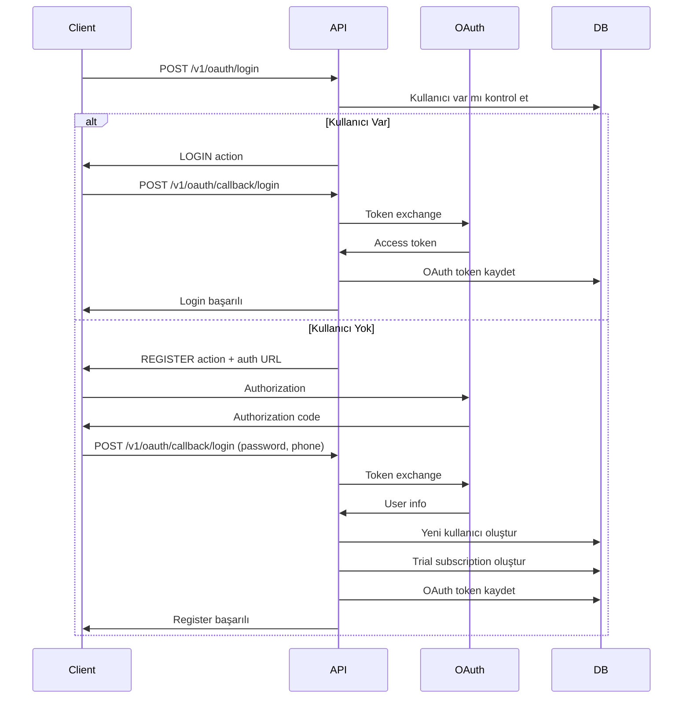

# OAuth Login/Register Entegrasyonu

## 📋 İçindekiler

1. [Genel Bakış](#genel-bakış)
2. [Akış Diyagramı](#akış-diyagramı)
3. [API Endpoint'leri](#api-endpointleri)
4. [Kullanım Senaryoları](#kullanım-senaryoları)
5. [Veri Yapısı](#veri-yapısı)
6. [Güvenlik](#güvenlik)
7. [Troubleshooting](#troubleshooting)

---

## 🔐 Genel Bakış

OAuth entegrasyonu artık kullanıcı kayıt ve giriş işlemlerini de destekliyor. Kullanıcılar Gmail veya Outlook hesapları ile:

- **Mevcut kullanıcılar:** OAuth ile giriş yapabilir
- **Yeni kullanıcılar:** OAuth ile kayıt olabilir
- **Otomatik rol atama:** Yeni kullanıcılar otomatik olarak USER rolü alır
- **Trial subscription:** Yeni kullanıcılar 3 günlük deneme süresi alır

### Özellikler

- ✅ **Akıllı Kullanıcı Tespiti:** Email ile kullanıcı var mı kontrol eder
- ✅ **Otomatik Kayıt:** Yeni kullanıcılar için otomatik hesap oluşturma
- ✅ **Güvenli Şifre:** Yeni kullanıcılar için şifre zorunlu
- ✅ **Telefon Doğrulama:** Yeni kullanıcılar için telefon zorunlu
- ✅ **Rol Yönetimi:** Otomatik USER rolü atama
- ✅ **Trial Subscription:** 3 günlük deneme süresi
- ✅ **OAuth Token Yönetimi:** Güvenli token saklama ve yenileme

---

## 🔄 Akış Diyagramı



---

## 🌐 API Endpoint'leri

### 1. OAuth Login/Register Başlat

```http
POST /v1/oauth/login
Content-Type: application/json

{
  "provider": "google",
  "email": "user@gmail.com",
  "password": "SecurePassword123",
  "phone": "05551234567",
  "redirectUri": "http://localhost:3000/oauth/callback"
}
```

**Response - Kullanıcı Var (LOGIN):**
```json
{
  "success": true,
  "data": {
    "action": "LOGIN",
    "message": "Kullanıcı bulundu, OAuth ile giriş yapılıyor",
    "userInfo": {
      "email": "user@gmail.com",
      "name": "John",
      "surname": "Doe",
      "provider": "google"
    },
    "requiresAdditionalInfo": false
  },
  "message": "Kullanıcı bulundu, OAuth ile giriş yapılıyor"
}
```

**Response - Kullanıcı Yok (REGISTER):**
```json
{
  "success": true,
  "data": {
    "action": "REGISTER",
    "message": "Yeni kullanıcı kaydı için OAuth authorization gerekli",
    "authorizationUrl": "https://accounts.google.com/o/oauth2/v2/auth?...",
    "state": "random-state-string",
    "requiresAdditionalInfo": true
  },
  "message": "Yeni kullanıcı kaydı için OAuth authorization gerekli"
}
```

### 2. OAuth Login/Register Callback

```http
POST /v1/oauth/callback/login
Content-Type: application/x-www-form-urlencoded

provider=google&code=authorization_code&redirectUri=http://localhost:3000/oauth/callback&password=SecurePassword123&phone=05551234567
```

**Response - Login Başarılı:**
```json
{
  "success": true,
  "data": {
    "action": "LOGIN",
    "message": "OAuth ile giriş başarılı",
    "userInfo": {
      "provider": "google",
      "email": "user@gmail.com",
      "name": "John",
      "surname": "Doe",
      "givenName": "John",
      "familyName": "Doe",
      "picture": "https://...",
      "locale": "tr"
    },
    "requiresAdditionalInfo": false
  },
  "message": "OAuth ile giriş başarılı"
}
```

**Response - Register Başarılı:**
```json
{
  "success": true,
  "data": {
    "action": "REGISTER",
    "message": "OAuth ile kayıt başarılı",
    "userInfo": {
      "provider": "google",
      "email": "newuser@gmail.com",
      "name": "Jane",
      "surname": "Smith",
      "givenName": "Jane",
      "familyName": "Smith",
      "picture": "https://...",
      "locale": "tr"
    },
    "requiresAdditionalInfo": false
  },
  "message": "OAuth ile kayıt başarılı"
}
```

---

## 💡 Kullanım Senaryoları

### Senaryo 1: Mevcut Kullanıcı OAuth ile Giriş

```javascript
// 1. Login isteği gönder
const loginResponse = await fetch('/v1/oauth/login', {
  method: 'POST',
  headers: {
    'Content-Type': 'application/json'
  },
  body: JSON.stringify({
    provider: 'google',
    email: 'existing@example.com',
    redirectUri: 'http://localhost:3000/oauth/callback'
  })
});

const { data } = await loginResponse.json();

if (data.action === 'LOGIN') {
  // Kullanıcı var, direkt giriş yap
  console.log('Kullanıcı giriş yapıyor:', data.userInfo);
  
  // JWT token al ve kullanıcıyı yönlendir
  // Bu kısım AuthService ile entegre edilecek
}
```

### Senaryo 2: Yeni Kullanıcı OAuth ile Kayıt

```javascript
// 1. Login isteği gönder
const loginResponse = await fetch('/v1/oauth/login', {
  method: 'POST',
  headers: {
    'Content-Type': 'application/json'
  },
  body: JSON.stringify({
    provider: 'google',
    email: 'newuser@example.com',
    redirectUri: 'http://localhost:3000/oauth/callback'
  })
});

const { data } = await loginResponse.json();

if (data.action === 'REGISTER') {
  // Kullanıcı yok, OAuth authorization gerekli
  console.log('OAuth authorization URL:', data.authorizationUrl);
  
  // Kullanıcıyı OAuth sayfasına yönlendir
  window.location.href = data.authorizationUrl;
}

// 2. OAuth callback'te kullanıcıdan ek bilgiler al
// Bu kısım frontend'de form ile yapılacak
const callbackResponse = await fetch('/v1/oauth/callback/login', {
  method: 'POST',
  headers: {
    'Content-Type': 'application/x-www-form-urlencoded'
  },
  body: new URLSearchParams({
    provider: 'google',
    code: 'authorization_code',
    redirectUri: 'http://localhost:3000/oauth/callback',
    password: 'SecurePassword123',
    phone: '05551234567'
  })
});

const { data: callbackData } = await callbackResponse.json();

if (callbackData.action === 'REGISTER') {
  console.log('Yeni kullanıcı kaydı başarılı:', callbackData.userInfo);
  // Kullanıcıyı dashboard'a yönlendir
}
```

### Senaryo 3: Frontend Form Entegrasyonu

```html
<!-- OAuth callback sayfası -->
<form id="oauthForm" style="display: none;">
  <h2>Ek Bilgiler Gerekli</h2>
  <p>Hesabınızı tamamlamak için aşağıdaki bilgileri girin:</p>
  
  <div>
    <label for="password">Şifre:</label>
    <input type="password" id="password" required>
  </div>
  
  <div>
    <label for="phone">Telefon:</label>
    <input type="tel" id="phone" required>
  </div>
  
  <button type="submit">Hesabı Tamamla</button>
</form>

<script>
// URL'den OAuth parametrelerini al
const urlParams = new URLSearchParams(window.location.search);
const provider = urlParams.get('provider');
const code = urlParams.get('code');
const state = urlParams.get('state');

if (code && provider) {
  // Form'u göster
  document.getElementById('oauthForm').style.display = 'block';
  
  // Form submit
  document.getElementById('oauthForm').addEventListener('submit', async (e) => {
    e.preventDefault();
    
    const password = document.getElementById('password').value;
    const phone = document.getElementById('phone').value;
    
    try {
      const response = await fetch('/v1/oauth/callback/login', {
        method: 'POST',
        headers: {
          'Content-Type': 'application/x-www-form-urlencoded'
        },
        body: new URLSearchParams({
          provider,
          code,
          redirectUri: window.location.origin + '/oauth/callback',
          password,
          phone
        })
      });
      
      const { data } = await response.json();
      
      if (data.action === 'REGISTER') {
        alert('Hesabınız başarıyla oluşturuldu!');
        // Kullanıcıyı dashboard'a yönlendir
        window.location.href = '/dashboard';
      }
      
    } catch (error) {
      console.error('Hata:', error);
      alert('Bir hata oluştu. Lütfen tekrar deneyin.');
    }
  });
}
</script>
```

---

## 📊 Veri Yapısı

### OAuthUserInfoDto

```java
public class OAuthUserInfoDto {
    private String provider;        // google, microsoft
    private String email;           // user@example.com
    private String name;            // John
    private String surname;         // Doe
    private String givenName;       // Google'dan gelen first name
    private String familyName;      // Google'dan gelen last name
    private String displayName;     // Microsoft'dan gelen display name
    private String picture;         // Profile picture URL
    private String locale;          // tr, en, etc.
    private String sub;             // OAuth provider'dan gelen unique ID
}
```

### OAuthLoginRequestDto

```java
public class OAuthLoginRequestDto {
    private String provider;        // google, microsoft
    private String email;           // user@example.com
    private String password;        // Yeni kullanıcı için şifre
    private String phone;           // Yeni kullanıcı için telefon
    private String redirectUri;     // OAuth callback URL
}
```

### OAuthLoginResponseDto

```java
public class OAuthLoginResponseDto {
    private String action;          // LOGIN, REGISTER
    private String message;         // Açıklayıcı mesaj
    private OAuthUserInfoDto userInfo;
    private String authorizationUrl; // OAuth authorization URL
    private String state;           // OAuth state parameter
    private Boolean requiresAdditionalInfo; // Ek bilgi gerekli mi
}
```

---

## 🔒 Güvenlik

### 1. Kullanıcı Doğrulama

- **Email Kontrolü:** Her OAuth işleminde email doğrulanır
- **Şifre Zorunluluğu:** Yeni kullanıcılar için güçlü şifre zorunlu
- **Telefon Zorunluluğu:** Yeni kullanıcılar için telefon zorunlu
- **Benzersiz Username:** Otomatik benzersiz username oluşturma

### 2. OAuth Güvenliği

- **State Parameter:** CSRF koruması
- **Scope Validation:** Minimum gerekli izinler
- **Token Security:** Güvenli token saklama
- **Redirect URI Validation:** Güvenli callback URL'leri

### 3. Veri Güvenliği

- **Password Hashing:** BCrypt ile şifre hashleme
- **Token Encryption:** OAuth token'ları şifrelenmiş saklama
- **Input Validation:** Tüm input'lar doğrulanır
- **SQL Injection Protection:** JPA ile güvenli sorgular

### 4. Monitoring

- **Security Logs:** Tüm OAuth işlemleri loglanır
- **Error Tracking:** Hata durumları izlenir
- **Audit Trail:** Kullanıcı işlemleri kaydedilir
- **Performance Monitoring:** API performansı ölçülür

---

## 🔧 Troubleshooting

### Yaygın Sorunlar

#### 1. "Şifre Gerekli" Hatası
**Semptom:** Yeni kullanıcı kaydında şifre hatası
**Çözüm:**
- Şifre alanının doldurulduğundan emin olun
- Şifre en az 8 karakter olmalı
- Şifre en az bir büyük harf içermeli

#### 2. "Telefon Gerekli" Hatası
**Semptom:** Yeni kullanıcı kaydında telefon hatası
**Çözüm:**
- Telefon alanının doldurulduğundan emin olun
- Telefon formatı: 05551234567 (11 haneli)

#### 3. "Kullanıcı Zaten Var" Hatası
**Semptom:** Mevcut kullanıcı için register hatası
**Çözüm:**
- Email adresini kontrol edin
- Farklı email ile kayıt olmayı deneyin

#### 4. "OAuth Token Hatası"
**Semptom:** OAuth callback'te token hatası
**Çözüm:**
- OAuth provider ayarlarını kontrol edin
- Client ID ve Secret'ı doğrulayın
- Redirect URI'yi kontrol edin

### Debug Modu

```properties
# Debug logging
logging.level.com.prospect.crm.service.OAuthService=DEBUG
logging.level.com.prospect.crm.controller.OAuthController=DEBUG
logging.level.org.springframework.security.oauth2=DEBUG
```

### Test Endpoint'leri

```http
# OAuth login test
POST /v1/oauth/login
{
  "provider": "google",
  "email": "test@example.com"
}

# OAuth callback test
POST /v1/oauth/callback/login
provider=google&code=test_code&password=Test123&phone=05551234567
```

---

## 📋 Best Practices

### 1. Frontend Entegrasyonu

- ✅ **Progressive Enhancement:** JavaScript olmadan da çalışır
- ✅ **Error Handling:** Kullanıcı dostu hata mesajları
- ✅ **Loading States:** İşlem durumunu göster
- ✅ **Form Validation:** Client-side validation

### 2. Backend Güvenliği

- ✅ **Input Validation:** Tüm input'ları doğrula
- ✅ **Rate Limiting:** API rate limiting
- ✅ **Logging:** Güvenlik logları tut
- ✅ **Error Handling:** Graceful error handling

### 3. User Experience

- ✅ **Clear Instructions:** Net talimatlar ver
- ✅ **Progress Indicators:** İşlem durumunu göster
- ✅ **Fallback Options:** Alternatif yöntemler sun
- ✅ **Mobile Friendly:** Mobil uyumlu tasarım

### 4. Performance

- ✅ **Caching:** Token'ları cache'le
- ✅ **Async Processing:** Asenkron işlemler
- ✅ **Database Optimization:** Veritabanı optimizasyonu
- ✅ **Monitoring:** Performans izleme

---

## 📚 Ek Kaynaklar

### Dokümantasyon
- [OAuth 2.0 RFC](https://tools.ietf.org/html/rfc6749)
- [Google OAuth2](https://developers.google.com/identity/protocols/oauth2)
- [Microsoft OAuth2](https://docs.microsoft.com/en-us/azure/active-directory/develop/v2-oauth2-auth-code-flow)

### Güvenlik
- [OAuth2 Security Best Practices](https://oauth.net/2/oauth-best-practice/)
- [OWASP Authentication Cheat Sheet](https://cheatsheetseries.owasp.org/cheatsheets/Authentication_Cheat_Sheet.html)

### Frontend
- [OAuth 2.0 for Browser-Based Apps](https://tools.ietf.org/html/draft-ietf-oauth-browser-based-apps)
- [OAuth 2.0 Security Best Current Practice](https://tools.ietf.org/html/draft-ietf-oauth-security-topics)

---

## 📞 Destek

### İletişim
- **Email:** support@prospect-crm.com
- **Documentation:** https://docs.prospect-crm.com
- **GitHub:** https://github.com/prospect-crm

### Katkıda Bulunma
1. Fork yapın
2. Feature branch oluşturun
3. Değişikliklerinizi commit edin
4. Pull request gönderin

### Lisans
Bu proje MIT lisansı altında lisanslanmıştır. Detaylar için [LICENSE](LICENSE) dosyasına bakın. 